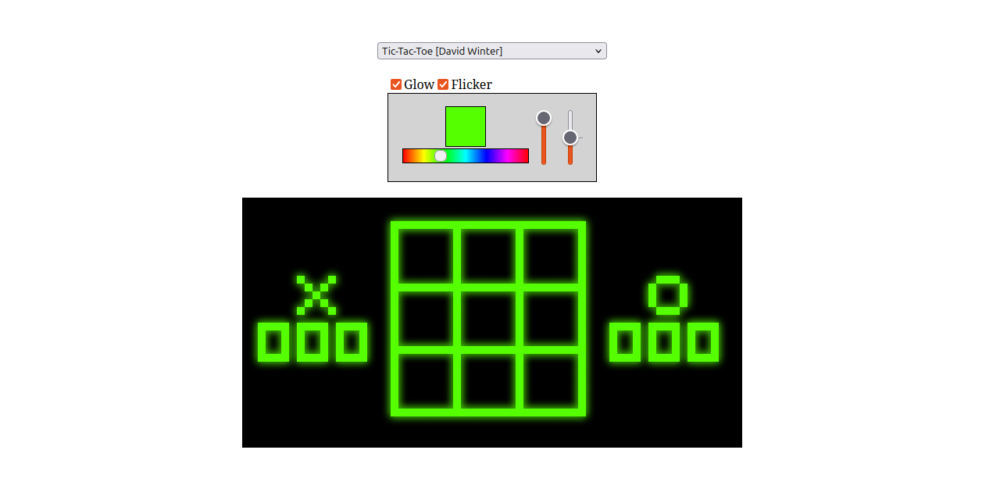

# Chip8.js

A [chip8](https://tobiasvl.github.io/blog/write-a-chip-8-emulator) emulator written in JavaScript.

[live](https://victorqribeiro.github.io/Chip8js/)

## Controls

Each program uses its own set of keys and I don't know them by heart, you have to try it out.  
Possible keys are:   
1, 2, 3, 4    
q, w, e, r    
a, s, d, f    
z, x, c, v
